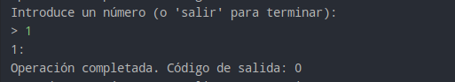
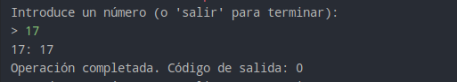
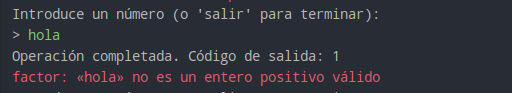
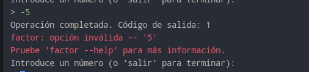

## Documentación Tarea05 PSP - Martín Barreiro

### 1.1 INTERFAZ: Pide al usuario un nº, en bucle, hasta que escriba salir.

### 1.2 LANZADOR: Recibe el nº, crea proceso (factor), código salida.

### 1.3 TABLA: Valor, salida y código salida:
#### Valor 360

#### Valor 1:

#### Valor 17:

#### Valor hola:

#### Valor -5:

